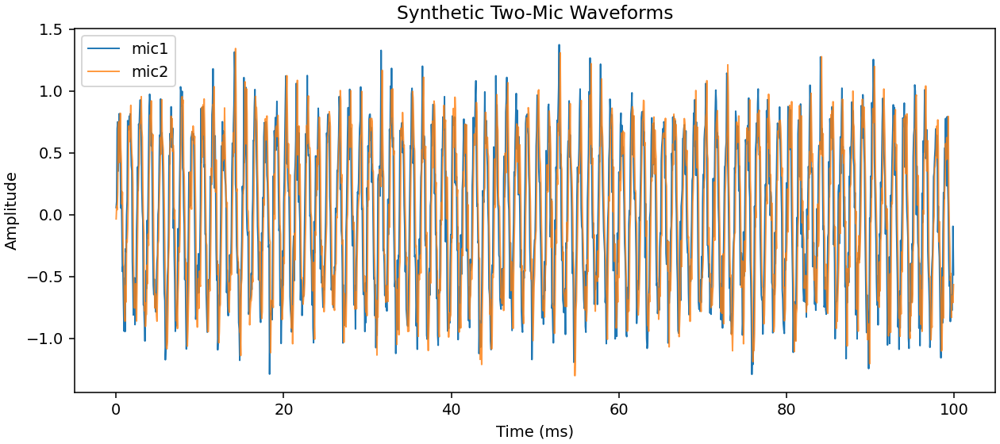
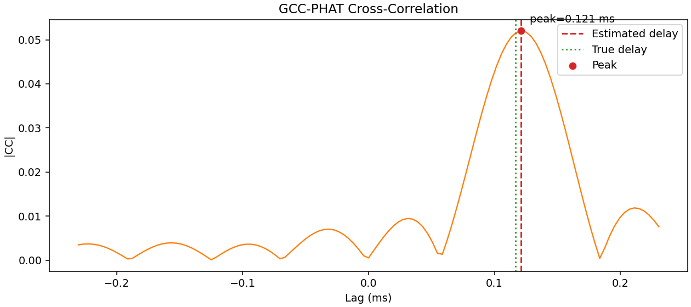

# labo-frontier-algorithms

Reproducible baseline implementations for frontier audio algorithms such as **sound source localization (SSL)** and **active noise control (ANC)**.
The goal of this repository is to provide **clean, deterministic, research-friendly baselines** for experimentation and learning.

---

# Who Is This For?

* Researchers exploring spatial audio algorithms
* Students learning signal processing and localization
* Engineers prototyping audio algorithms

---

# Quick Start

Clone the repository and install the package:

```bash
git clone https://github.com/edjx22/labo-frontier-algorithms.git
cd labo-frontier-algorithms

python -m venv .venv
source .venv/bin/activate

pip install -U pip
pip install -e .[dev]
```

Show available CLI commands:

```bash
python -m labo_frontier_algorithms --help
```

Run the SSL demo:

```bash
python -m labo_frontier_algorithms run_ssl_demo --outdir out
```

The demo generates the following outputs:

* `out/waveforms.png`
* `out/xcorr.png`
* `out/result.json`

---

# Example Output

Example `result.json`:

```json
{
  "abs_error_deg": 0.0,
  "est_angle_deg": 30.0,
  "est_delay": 0.00011607142857142857,
  "true_angle_deg": 30.0,
  "true_delay": 0.00011661807580174927
}
```

---

# Demo Output

Synthetic two-microphone example using the **GCC-PHAT** algorithm.

### Waveforms



### Cross-correlation



Example estimation result:

```json
{
  "true_angle_deg": 30,
  "est_angle_deg": 31.28,
  "abs_error_deg": 1.28
}
```

---

# Reproducibility Notes

The SSL baseline uses deterministic synthetic signals.

Key properties:

* Two-channel sinusoidal mixtures
* Fixed random seed for reproducibility
* No external datasets required
* No model downloads

Core algorithm:

* **GCC-PHAT** for time difference of arrival (TDOA)
* Angle reconstruction from estimated delay

Default demo parameters:

```
sample_rate = 16000
duration = 0.1 s
frequency = 800 Hz
mic_distance = 0.08 m
angle = 30 deg
snr = 20 dB
seed = 42
```

These fixed parameters ensure consistent output across runs.

---

# Reproduce the Demo

```bash
python -m venv .venv
source .venv/bin/activate

pip install -U pip
pip install -e .[dev]

python -m labo_frontier_algorithms run_ssl_demo --outdir out
python -m json.tool out/result.json
```

---

# Project Structure

```text
labo_frontier_algorithms/
  signal.py      # synthetic signal generation
  ssl.py         # GCC-PHAT and angle estimation
  demo.py        # plotting and experiment runner
  __main__.py    # CLI entrypoint

experiments/
  run_ssl_demo.py

tests/
  test_ssl.py
  test_cli.py
```

---

# Development

Run linting:

```bash
ruff check .
```

Run type checking:

```bash
mypy labo_frontier_algorithms
```

Run tests:

```bash
pytest
```

CI automatically runs:

* lint checks
* type checking
* tests

on Python **3.10 / 3.11 / 3.12**.

---

# Roadmap

Short term

* Add broadband and chirp-based SSL benchmarks
* Improve SSL visualization and error analysis

Mid term

* Add ANC baseline (FxLMS) with synthetic acoustic paths
* Add experiment configuration snapshots

Long term

* Add benchmark framework for spatial audio algorithms
* Add richer plots and comparison summaries

---

# Citation

If this repository helps your research or project, please cite it using the information provided in `CITATION.cff`.

---

# License

Apache License 2.0. See the `LICENSE` file for details.
